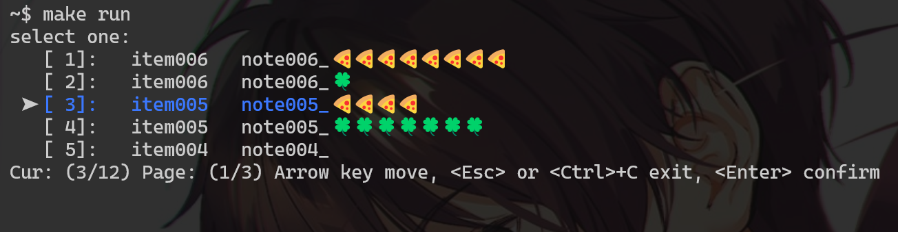

# climenu

[README](README.md) | [中文文档](README_zh.md)

The selection menu for the command line program in terminal.

Supports various terminals under Windows, Linux, and MacOS.



## Example

```go
...
m := climenu.New()
m.Add("name1", "note1", nil, func(e *climenu.Item) error {
    fmt.Println("selected: ", e)
    return nil
})
m.Add("name2", "note2", nil, func(e *climenu.Item) error {
    fmt.Println("selected: ", e)
    return nil
})
m.run()
...
```
