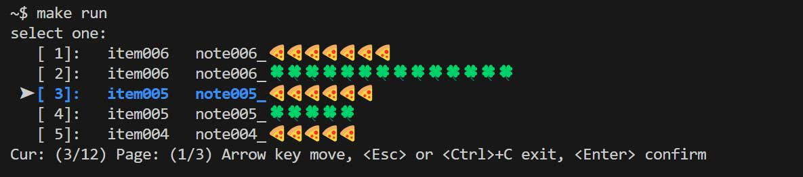

# climenu

[README](README.md) | [中文文档](README_zh.md)

The selection menu for the command line program in terminal.

Supports various terminals under Windows, Linux, and MacOS.



## Install

```bash
go get -u github.com/wels99/climenu
```

## Example

- Example 1

```go
...
m := climenu.New()
m.Add("name1", "note1", nil, func(e *climenu.Item) error {
    fmt.Println("selected: ", e)
    return nil
})
m.Add("name2", "note2", nil, func(e *climenu.Item) error {
    fmt.Println("selected: ", e)
    return nil
})
m.run()
...
```

- Example 2

```go
package main

import (
    "fmt"
    "math/rand"
    "strings"

    "github.com/wels99/climenu"
)

func main() {

    mitems := [][]string{
        {"item001", "note001"},
        {"item002", "note002"},
        {"item003", "note003"},
        {"item004", "note004"},
        {"item005", "note005"},
        {"item006", "note006"},
    }

    m := climenu.New()

    m.SetIndex(true)
    m.SetSelectIcon(" \u27A4 ") // '➤'
    m.SetMessage("select one:")
    m.SetPagesize(5)
    // m.SetSelectedColor(menu.Color_Red)
    // m.SetDelimiter("|")
    // m.Seti18n("当前", "页", "方向键移动，回车确认")

    for _, v := range mitems {
        name := v[0]
        note := fmt.Sprintf("%s_%s", v[1], strings.Repeat("🍕", rand.Intn(10)))
        note2 := fmt.Sprintf("%s_%s", v[1], strings.Repeat("🍀", rand.Intn(20)))

        m.Add(name, note, v, func(e *climenu.Item) error {
            fmt.Println("selected: ", e)
            return nil
        })
        m.AddItem(climenu.Item{
            Name: name,
            Note: note2,
            Tags: v,
            Act: func(e *climenu.Item) error {
                fmt.Println("new item selected: ", e)
                return nil
            },
        })
    }

    m.Sort(func(i, j *climenu.Item) bool {
        return i.Name > j.Name
    })

    ret, _ := m.Run()
    if ret > 0 {
        e, _ := m.GetItem(ret)
        fmt.Println("return:", e)
    }
}
```
